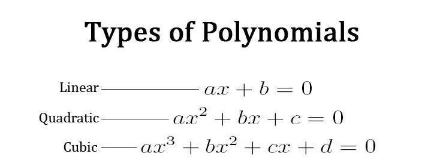
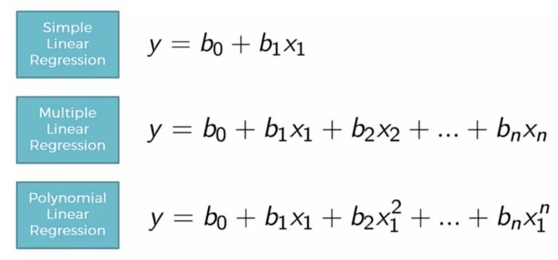
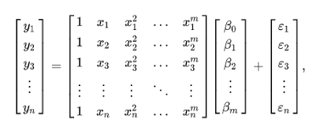
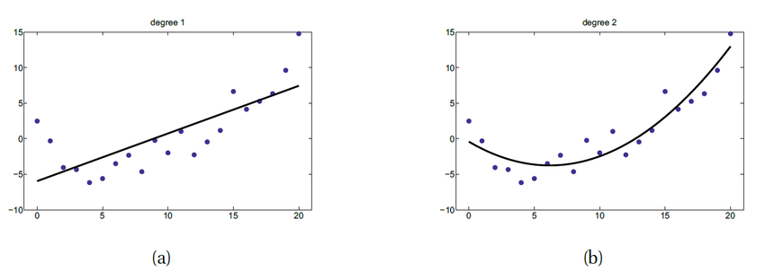
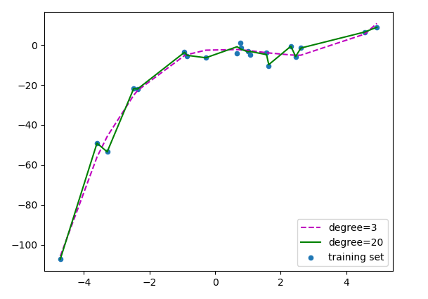

# Polynomial Regression

Assim como os outros modelos lineares, o seu objetivo é reduzir a soma dos quadrados residuais. Este modelo polinomial é usado para problemas não lineares. Como estamos falando 
de uma regressão polinomial, podemos ter n graus definidos em nosso modelo. Abaixo estão listados alguns destes graus:

Para facilitar o entendimento, vamos definir alguns outros tipos de regressão linear:
* **Regressão Linear Simples:** tem o objetivo de encontrar o relacionamento linear entre duas variáveis, sendo uma independente e a outra dependente;
* **Regressão Linear Múltipla:**  é usada para explicar o relacionamento linear entre uma variável dependente, e duas ou mais independentes.

Já a regressão polinomial, é usada quando não conseguimos capturar os dados com uma regressão linear simples, e isso ocorre aumentando o grau do modelo, e quanto mais aumentamos 
o grau do modelo, a performance do modelo também aumenta, porém ao fazer isso, o risco de ocorrer underfitting ou overfitting é maior. A imagem abaixo exemplifica essa diferença 
entre os modelos de regressão: 

Para se encontrar o valor de b (constante), devemos usar uma multiplicação de matriz, e quando temos múltiplas variáveis esta multiplicação ocorre da seguinte maneira:

Um uso interessante para o modelo é por exemplo, na taxa de propagação de uma doença, ou até mesmo a taxa de propagação da pandemia pelo mundo. Isso ocorre, pois os dados não 
ocorrem de maneira linear. E nesse exemplo, o modelo é vantajoso, pois quando usamos um modelo de grau 2, será criado uma curva quadrática, que acaba se ajustando melhor nesses 
dados não lineares, do que uma linha linear. A imagem abaixo, mostra a comparação entre um modelo linear (ou uma regressão polinomial de primeiro grau) e um polinomial de segundo 
grau:

Quando falamos em uma curva quadrática, estamos definindo uma regressão polinomial de grau 2 (ordem 2), podemos usar quantos graus forem necessários, porém quanto maior o grau da 
regressão, o modelo vai estar bem ajustado aos dados, o que não é muito interessante, pois pode ocorrer o overfitting, que é justamente o ajuste excessivo do modelo sobre os 
dados, desta forma o modelo acaba se ajustando aos ruídos. Para ilustrar este ajuste excessivo, abaixo temos o gráfico de um modelo polinomial de ordem 20:

Mas como podemos escolher a melhor ordem para o modelo polinomial? Para fazer isso podemos entender a relação entre o viés e a variância. Um viés (bias) alto, resulta em um 
modelo que contém muitos erros, pois não consegue capturar a maioria dos dados (underfitting). Já uma variância alta, resulta em modelo que faz um ajuste excessivo aos dados 
(overfitting). Para fazer esta verificação podemos usar dois métodos:
* **Forward Selection:** Aumentamos a ordem do modelo até que ele tenha um resultado significante para definir o melhor modelo possível;
* **Backward Selection:** Funcionamneto semelhante ao método anterior, porém ao invés de aumentar, nós diminuimos a ordem do modelo.

---

### Vantagens do modelo:
1. O modelo polinomial fornece a melhor aproximação entre a relação entre as variáveis dependentes e não dependentes;
2. É capaz de se ajustar a uma ampla gama de dados, isso se deve porque o modelo é capaz de se ajustar aos dados usados, ou seja, ele pode se comportar desde um modelo linear 
simples, usando apenas uma variável, até um modelo mais complexo, usando várias variáveis;
3. Através da sua capacidade de usar muitas variáveis, o modelo se ajusta a dados não lineares.

---

### Desvantagens do modelo:
1. A presença de outliers, afeta drasticamente os resultados da análise não linear, pois para se ajustar a dados mais complexos, o grau do modelo precisa aumentar, e quando maior 
a ordem do modelo, a chance de acontecer overfitting é alta;
2. Não existem muitas ferramentas de validação de modelo para a detecção de outliers em modelos não lineares;
3. A sensibilidade a outliers é muito alta neste modelo.

---

### Diferença entre os modelos de regressão:
O modelo de regressão polinomial, ainda pode ser considerado um modelo linear, desde que seus coeficientes ainda sejam lineares. Podemos diferenciar os modelos da seguinte maneira:
* **Ridge X Polinomial:** Um modelo de regressão Ridge é muito poderoso quando o modelo é menos suscetível a overfitting, neste modelo quando aumentamos o valor de α, a inclinação 
da reta se aproxima ao eixo X. Já no modelo polinomial, ao aumentar o grau da equação, a inclinação aumenta, se ajustando aos dados;
* **Lasso X Polinomial:** No modelo de regressão Lasso, nós conseguimos eliminar as variáveis não tão úteis. Já no modelo polinomial, os resultados são drasticamente afetados 
pelos dados fora da curva, os chamados outliers, podendo até causar overfitting pelo ajuste em excesso aos dados;
* **Elastic Net X Polinomial:** O modelo Elastic Net, é muito usado quando temos milhares de dados, pois ele é melhor com dados que estão ligados entre si. Já no modelo polinomial,
quando temos muitos dados, a ordem também aumenta, e quando esse grau é elevado, o modelo fica super ajustado aos dados, e isso não acaba sendo muito interessante para a análise 
do modelo. 
